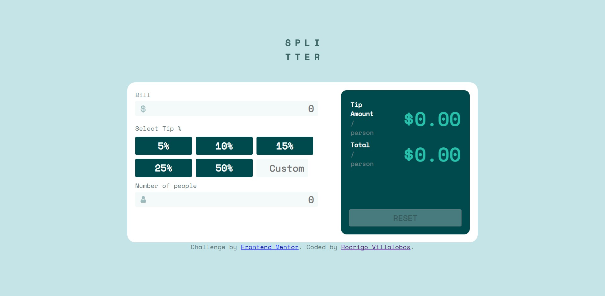

# Frontend Mentor - Tip calculator app

This is a solution to the [Tip calculator app challenge on Frontend Mentor](https://www.frontendmentor.io/challenges/tip-calculator-app-ugJNGbJUX). 

## Table of contents

- [Overview](#overview)
  - [The challeng/Proyecto](#the-challenge)
  - [Screenshot](#screenshot)
  - [Links](#links)
- [My process/Proceso](#my-process)
  - [Built with/Programado con](#built-with)
  - [What I learned](#what-i-learned)
  - [Continued development](#continued-development)
- [Author/Autor](#Rodrigo Villalobos)

## Overview/

### The challenge:

Users should be able to/Los usuarios deben ser capaces de:

- View the optimal layout for the app depending on their device's screen size/Visualizar la distribucion correcta de la aplicacion dependiendo del tamaño de pantalla que se utiliza.
- See hover states for all interactive elements on the page/Visualizar los elementos interactivos en la pagina
- Calculate the correct tip and total cost of the bill per person/Calcular la propina correcta y el costo total por persona

### Screenshot

### Links

- Solution URL: [Add solution URL here](https://github.com/Rravg/Tip-calculator-app)
- Live Site URL: [Add live site URL here](https://rravg.github.io/Tip-calculator-app/)

## My process

### Built with

- Semantic HTML5 markup/HTML5
- CSS custom properties/CSS
- Flexbox
- CSS Grid

### What I learned

In this project I learned how to take input fields information from the user.
I improved my skills with laying grids and also understood the importance of making sure your web app is compatible with all browsers and screen-sizes. 

En este proyecto aprendi como tomar informacion ingresada por el usuario a traves de campos de entrada. 
Mejore mis habilidades usando "Grids" en html y entendi la importancia de que una aplicacion web sea compatible con todo tipo de navegadores y tamaños de pantalla.

### Continued development

Continue learning on compatibility issues acrros browsers and screen-sizes.

Quiero seguir estudiando mejores metodos para hacer que la apliacion sea compatible con todo tipo de navegadores y tamaños de pantalla

## Author

- Website - [Rodrigo Alexander Villalobos Garcia](https://github.com/Rravg)
- Frontend Mentor - [@rravg](https://www.frontendmentor.io/profile/Rravg)

 🚀 🎉
